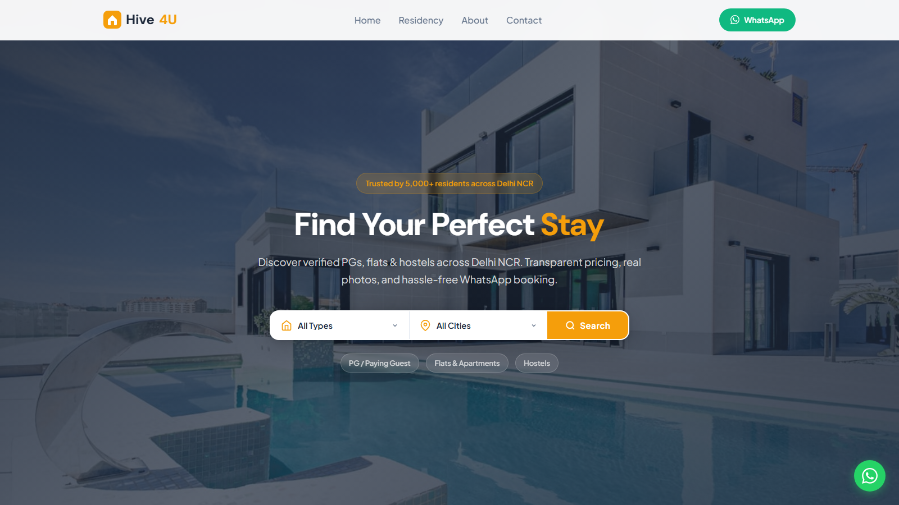

# Hive4U - Accommodation Listing Platform



**Domain:** [hive4u.in](https://hive4u.in)
**Live URL:** [hive4u.vercel.app](https://hive4u.vercel.app)
**Tech Stack:** HTML, CSS, Vanilla JS (zero frameworks, zero build tools)
**Hosting:** Vercel (auto-deploys from GitHub)
**Domain Registrar:** GoDaddy
**DNS:** Cloudflare

---

## Table of Contents

1. [Project Overview](#project-overview)
2. [Project Structure](#project-structure)
3. [Pages & URLs](#pages--urls)
4. [Admin Panel](#admin-panel)
5. [How Data Works](#how-data-works)
6. [How to Add/Edit/Delete Listings](#how-to-addeditdelete-listings)
7. [Image Management](#image-management)
8. [Listing Data Schema](#listing-data-schema)
9. [Design System](#design-system)
10. [SEO & Structured Data](#seo--structured-data)
11. [WhatsApp Integration](#whatsapp-integration)
12. [Room Type Options](#room-type-options)
13. [Local Development](#local-development)
14. [Deployment & Hosting](#deployment--hosting)
15. [DNS & Domain Setup](#dns--domain-setup)
16. [How Auto-Deploy Works](#how-auto-deploy-works)
17. [Security](#security)
18. [Social Media Links](#social-media-links)
19. [Common Tasks Quick Reference](#common-tasks-quick-reference)
20. [Troubleshooting](#troubleshooting)
21. [Credentials Reference](#credentials-reference)

---

## Project Overview

Hive4U is a **fully static** accommodation listing website for Delhi NCR (Noida, Greater Noida, Delhi, Gurugram, Ghaziabad). It lists PGs, flats, and hostels with WhatsApp-based booking.

**Key Features:**
- Zero backend for the public site (pure static HTML/CSS/JS)
- All data stored in a single JSON file (`public/data/listings.json`)
- Admin panel with dual-password protection at a hidden URL
- Admin CRUD operations commit directly to GitHub, triggering Vercel auto-redeploy
- WhatsApp booking with pre-filled messages
- Google Drive image support (paste Drive share links, auto-converts to direct URLs)
- Responsive design (mobile-first)
- SEO optimized with JSON-LD structured data, Open Graph, geo tags
- Floating WhatsApp button on all pages

---

## Project Structure

```
staynest/
├── api/
│   └── listings.js              # Vercel serverless API (GET only, reads listings.json)
│
├── public/                       # All public-facing files (Vercel serves from here)
│   ├── index.html                # Homepage - hero, featured listings, stats, testimonials, cities
│   ├── residency.html            # Browse/filter page - all listings with sidebar filters
│   ├── listing.html              # Individual listing detail (query param: ?id=xxx)
│   ├── about.html                # About page
│   ├── contact.html              # Contact page (form redirects to WhatsApp)
│   ├── privacy-policy.html       # Privacy Policy
│   ├── terms-of-service.html     # Terms of Service
│   ├── refund-policy.html        # Refund Policy
│   ├── admin.html                # Admin panel (accessed via hidden URL only)
│   │
│   ├── css/
│   │   ├── style.css             # Global styles, CSS variables, floating WA button, utilities
│   │   ├── components.css        # Navbar, listing cards, footer, skeleton loaders
│   │   ├── home.css              # Homepage: hero, search bar, browse types, stats, testimonials
│   │   ├── residency.css         # Residency page: sidebar filters, grid, mobile drawer
│   │   └── listing.css           # Listing detail: gallery, price card, amenities, responsive
│   │
│   ├── js/
│   │   ├── app.js                # Global: renders navbar, footer, WhatsApp float, scroll reveal
│   │   ├── data.js               # Data layer: fetches listings.json, caching, helper queries
│   │   └── utils.js              # Helpers: WhatsApp links, price formatting, card rendering, filters
│   │
│   └── data/
│       └── listings.json         # MASTER DATA FILE - all listings live here
│
├── server.js                     # Express server (local development only)
├── vercel.json                   # Vercel deployment config
├── package.json                  # Node dependencies (express, cors, uuid)
└── .gitignore                    # Ignores node_modules
```

---

## Pages & URLs

### Public Pages

| Page | URL | Description |
|------|-----|-------------|
| Homepage | `/` or `/index.html` | Hero search, featured listings, stats, testimonials, cities |
| Residency | `/residency.html` | Browse all listings with filters (type, subtype, city, price, gender, amenities) |
| Listing Detail | `/listing.html?id=pg-001` | Single listing view with gallery, amenities, map, WhatsApp CTA |
| About | `/about.html` | Mission, values, trust stats |
| Contact | `/contact.html` | Contact cards, WhatsApp form |
| Privacy Policy | `/privacy-policy.html` | Privacy & data policy |
| Terms of Service | `/terms-of-service.html` | Platform usage terms |
| Refund Policy | `/refund-policy.html` | Refund/payment clarification |

### Admin Panel

| Page | URL | Description |
|------|-----|-------------|
| Admin Panel | `/sau85_hivu85` | Hidden URL, dual password login, full CRUD |
| Old `/admin.html` | Blocked | Returns 302 redirect to homepage |

---

## Admin Panel

### Access
- **URL:** `https://hive4u.in/sau85_hivu85`
- **Username:** `admin`
- **Password 1:** `sau5934#$@jy`
- **Password 2:** `sau5304#@@jy`

Both passwords are required to login. Session is stored in `sessionStorage` (cleared when browser tab closes).

### Features
- **Dashboard stats:** Total listings, active, featured, cities count
- **Search:** Filter table by title, city, area
- **Type filter:** Filter by PG/Flat/Hostel
- **Add listing:** Full form with all fields, image management, amenity checkboxes, featured/active toggles
- **Edit listing:** Pre-fills all fields from existing data
- **Delete listing:** Confirmation dialog before delete
- **Image management:** Paste Google Drive links or any URL, auto-converts Drive links to direct image URLs

### How Admin Saves Work (IMPORTANT)
The admin panel **does NOT use a backend API** for writes. Instead:

1. Admin makes a change (add/edit/delete)
2. The JavaScript modifies the data in memory
3. It commits the updated `listings.json` to GitHub via the **GitHub API**
4. GitHub push triggers **Vercel auto-redeploy** (~30 seconds)
5. The live site serves the updated data

This means changes take ~30 seconds to appear on the live site after saving.

### Changing Admin Credentials
Edit `public/admin.html` and find these lines near the top of the `<script>` section:
```javascript
const ADMIN_USER = 'admin';
const ADMIN_PASS_1 = 'sau5934#$@jy';
const ADMIN_PASS_2 = 'sau5304#@@jy';
```

### Changing Admin URL
1. Edit `vercel.json` — change the rewrite source from `/sau85_hivu85` to your new URL
2. Edit `server.js` — change the route path for local development
3. Push to GitHub

---

## How Data Works

### Data Flow
```
listings.json (in GitHub repo)
      │
      ├── Vercel deploys → served as static file at /data/listings.json
      │
      ├── Client-side JS (data.js) fetches /data/listings.json
      │   └── Renders pages: homepage cards, residency grid, listing detail
      │
      └── Admin panel reads the same JSON
          └── On save → commits updated JSON to GitHub via API
              └── Triggers Vercel redeploy → new data live in ~30s
```

### Data File Location
- **In repo:** `public/data/listings.json`
- **Live URL:** `https://hive4u.in/data/listings.json`

### Data Structure
The JSON file contains:
```json
{
  "listings": [ ... ],           // Array of listing objects
  "cities": ["Noida", ...],     // Available city options
  "amenityLabels": {             // Amenity key → display label mapping
    "wifi": "WiFi",
    "ac": "AC",
    ...
  }
}
```

---

## How to Add/Edit/Delete Listings

### Method 1: Admin Panel (Recommended)
1. Go to `https://hive4u.in/sau85_hivu85`
2. Login with dual passwords
3. Click "+ Add Listing" or "Edit" on existing
4. Fill the form and save
5. Wait ~30 seconds for live site to update

### Method 2: Direct JSON Edit
1. Open `public/data/listings.json`
2. Add/edit/remove listing objects
3. Commit and push to GitHub
4. Vercel auto-deploys in ~30 seconds

---

## Image Management

### Supported Image Sources
1. **Google Drive** — Upload image to Drive → Share → Copy link → Paste in admin
   - Supported formats:
     - `https://drive.google.com/file/d/FILE_ID/view?usp=sharing`
     - `https://drive.google.com/open?id=FILE_ID`
     - `https://drive.google.com/uc?id=FILE_ID`
   - Auto-converts to: `https://lh3.googleusercontent.com/d/FILE_ID=w800`

2. **Unsplash** — Use any Unsplash URL with params:
   - `https://images.unsplash.com/photo-xxx?w=800&h=600&fit=crop`

3. **Any direct URL** — Any image URL that returns an image

### Google Drive Image Steps
1. Upload image to Google Drive
2. Right-click → Share → "Anyone with the link" → Copy link
3. In admin panel, paste the link in the image field
4. Click "Add" — it auto-converts to a direct URL
5. The image shows as "Drive" badge in the list

### Image Recommendations
- Use at least 3 images per listing
- Recommended size: 800x600 or larger
- For Unsplash, add `?w=800&h=600&fit=crop` to URLs
- Card thumbnails use 4:3 aspect ratio
- Gallery uses 16:9 aspect ratio

---

## Listing Data Schema

```json
{
  "id": "pg-001",                          // Unique ID (auto-generated on create)
  "type": "pg",                            // "pg" | "flat" | "hostel"
  "subtype": "single",                     // See Room Type Options below
  "title": "Sunrise PG for Boys",
  "slug": "sunrise-pg-boys-sector-62",     // Auto-generated from title
  "location": {
    "area": "Sector 62",                   // Locality/sector
    "city": "Noida",                       // City name
    "state": "Uttar Pradesh",
    "fullAddress": "Plot 45, Sector 62, Noida, UP 201301",
    "gmapEmbed": "<iframe src='...'></iframe>",  // Google Maps embed HTML
    "gmapLink": "https://maps.google.com/?q=...", // Google Maps link
    "lat": 28.6274,
    "lng": 77.3650
  },
  "price": {
    "amount": 8500,                        // Price number
    "period": "month",                     // "month" | "year"
    "currency": "INR"
  },
  "description": "Full text description...",
  "amenities": ["wifi", "ac", "food"],     // Array of amenity keys
  "images": [                              // Array of image URLs
    "https://images.unsplash.com/...",
    "https://lh3.googleusercontent.com/d/..."
  ],
  "gender": "boys",                        // "boys" | "girls" | "unisex" | "family"
  "rating": 4.5,                           // 0 to 5
  "featured": true,                        // Show on homepage featured section
  "available": true,                       // Active/visible on site
  "postedDate": "2026-03-15"               // ISO date string
}
```

### Available Amenity Keys
`wifi`, `ac`, `food`, `laundry`, `power-backup`, `parking`, `gym`, `cctv`, `water-purifier`, `geyser`

---

## Design System

### Colors (CSS Variables in style.css)
```css
--primary: #F59E0B        /* Amber/Gold - brand color */
--primary-dark: #D97706   /* Darker amber */
--primary-light: #FEF3C7  /* Light amber background */
--secondary: #1E293B      /* Dark slate - text, nav */
--accent: #10B981         /* Green - WhatsApp, CTA */
--bg: #FAFAF9             /* Warm off-white background */
--text: #1E293B           /* Primary text */
--text-muted: #64748B     /* Secondary text */
```

### Typography
- **Headings:** DM Sans (Google Fonts) - bold, modern
- **Body:** Plus Jakarta Sans (Google Fonts) - clean, readable

### Breakpoints
- **Desktop:** > 1024px (sidebar + grid)
- **Tablet:** 768-1024px (stacked, 2-col grid)
- **Mobile:** < 768px (single col, hamburger nav, bottom sheet filters)

---

## SEO & Structured Data

### Meta Tags (on all pages)
- Title, description, keywords
- Canonical URL
- Open Graph (og:title, og:description, og:type, og:url)
- Geo tags (geo.region: IN-DL, geo.placename: Delhi NCR)
- Robots: index, follow

### JSON-LD Schemas (on homepage)
1. **WebSite** — with SearchAction for site search
2. **LocalBusiness** — business info, address, phone, social links, service areas
3. **FAQPage** — 4 common questions about Hive4U (helps with Google rich results)

---

## WhatsApp Integration

### Admin Phone
**+91 7033237130**

### How It Works
- Every "Book Now" / "Enquire" button generates a WhatsApp link
- Pre-filled message includes listing title and location
- Contact page form redirects to WhatsApp with all form data

### Changing WhatsApp Number
Edit `public/js/utils.js`:
```javascript
const WHATSAPP_PHONE = "917033237130";  // Change this
```

### WhatsApp Link Format
```
https://wa.me/917033237130?text=Hi, I'm interested in "LISTING_TITLE" at LOCATION...
```

### Floating WhatsApp Button
Green circular button fixed at bottom-right on ALL pages. Defined in:
- CSS: `public/css/style.css` (`.whatsapp-float` class)
- JS: `public/js/app.js` (`renderWhatsAppFloat()` function)

---

## Room Type Options

### PG (Paying Guest)
| Value | Label |
|-------|-------|
| `single` | Single Sharing |
| `double` | Double Sharing |
| `triple` | Triple Sharing |
| `four` | Four Sharing |
| `any` | Any / Not Specified |

### Flat
| Value | Label |
|-------|-------|
| `1bhk` | 1 BHK |
| `2bhk` | 2 BHK |
| `3bhk` | 3 BHK |
| `4bhk` | 4 BHK |
| `studio` | Studio |
| `any` | Any / Not Specified |

### Hostel
| Value | Label |
|-------|-------|
| `1seater` | 1 Seater |
| `2seater` | 2 Seater |
| `3seater` | 3 Seater |
| `4seater` | 4 Seater |
| `6seater` | 6 Seater |
| `any` | Any / Not Specified |

### Where Subtypes Are Defined (update ALL when adding new options)
1. `public/residency.html` — `subtypeMap` object (~line 150)
2. `public/admin.html` — `subtypeMap` object (~line 607)

---

## Local Development

### Prerequisites
- Node.js 18+ installed
- Git installed

### Setup
```bash
cd staynest
npm install
npm run dev
```

### Local URLs
- Website: `http://localhost:3000`
- Admin: `http://localhost:3000/sau85_hivu85`

### How Local Server Differs from Vercel
- Local: Express server (`server.js`) serves static files from `public/` and handles API routes
- Vercel: Static files served from `public/` (set via `outputDirectory`), admin CRUD uses GitHub API

---

## Deployment & Hosting

### Stack
- **Repository:** [github.com/sandeep100000/hive4u](https://github.com/sandeep100000/hive4u) (private)
- **Hosting:** Vercel (free tier)
- **Domain:** GoDaddy (hive4u.in)
- **DNS:** Cloudflare

### Vercel Project Settings
```
Project Name: hive4u
Framework: None
Build Command: (empty)
Install Command: (empty)
Output Directory: public
```

### vercel.json
```json
{
  "buildCommand": "",
  "installCommand": "",
  "outputDirectory": "public",
  "rewrites": [
    { "source": "/sau85_hivu85", "destination": "/admin.html" }
  ],
  "redirects": [
    { "source": "/admin.html", "destination": "/", "statusCode": 302 },
    { "source": "/admin", "destination": "/", "statusCode": 302 }
  ]
}
```

---

## DNS & Domain Setup

### Cloudflare DNS Records
| Type | Name | Value | Proxy |
|------|------|-------|-------|
| A | `@` | `76.76.21.21` | DNS only (grey cloud) |
| CNAME | `www` | `cname.vercel-dns.com` | DNS only (grey cloud) |

### Cloudflare SSL Settings
- SSL/TLS mode: **Full (Strict)**
- Edge Certificates: **Always Use HTTPS** enabled

### GoDaddy Nameservers
Set to Cloudflare nameservers (found in Cloudflare dashboard when adding the site).

---

## How Auto-Deploy Works

```
Edit code or use admin panel
        │
        ▼
Git push to GitHub (main branch)
        │
        ▼
Vercel detects push automatically
        │
        ▼
Vercel builds & deploys (~30 seconds)
        │
        ▼
Live site updated at hive4u.in
```

**Admin panel saves** also trigger this flow because they commit to GitHub via the GitHub API.

---

## Security

### Admin Panel Protection
1. **Hidden URL** — `/sau85_hivu85` (not linked from any public page)
2. **Dual passwords** — Both must be correct to login
3. **Session-based** — Uses `sessionStorage` (cleared on tab close)
4. **Old URL blocked** — `/admin.html` and `/admin` return 302 redirect

### Important Security Notes
- Admin credentials are stored in client-side JavaScript (visible in page source)
- The hidden URL provides security-through-obscurity
- For stronger security, consider server-side authentication
- GitHub token is embedded in admin.html for CRUD operations
- Never expose the admin URL publicly

### Tokens Used
- **GitHub Personal Access Token** — For admin CRUD (commits to repo)
- **Vercel Token** — For deployment management

---

## Social Media Links

| Platform | URL | Updated In |
|----------|-----|------------|
| Facebook | https://www.facebook.com/hiveforyou/ | `public/js/app.js` (footer) |
| Instagram | https://www.instagram.com/hive_4u | `public/js/app.js` (footer) |

To update social links, edit the `renderFooter()` function in `public/js/app.js`.

---

## Common Tasks Quick Reference

| Task | How To |
|------|--------|
| **Add a listing** | Admin panel → "+ Add Listing" → Fill form → Save |
| **Edit a listing** | Admin panel → Click "Edit" on listing row → Modify → Save |
| **Delete a listing** | Admin panel → Click "Delete" → Confirm |
| **Change price** | Admin panel → Edit listing → Change price amount → Save |
| **Mark unavailable** | Admin panel → Edit listing → Toggle "Available" off → Save |
| **Feature on homepage** | Admin panel → Edit listing → Toggle "Featured" on → Save (max 6 shown) |
| **Add images (Google Drive)** | Upload to Drive → Share → Copy link → Paste in admin image field → Add |
| **Add images (URL)** | Paste any image URL in admin image field → Add |
| **Change WhatsApp number** | Edit `public/js/utils.js` → Change `WHATSAPP_PHONE` |
| **Change admin password** | Edit `public/admin.html` → Change `ADMIN_PASS_1` and `ADMIN_PASS_2` |
| **Change admin URL** | Edit `vercel.json` rewrites + `server.js` route |
| **Add new city** | Cities auto-add when you create a listing with a new city |
| **Add new amenity** | Add to `amenityLabels` in `listings.json` + add checkbox in admin form |
| **Add new room subtype** | Update `subtypeMap` in both `residency.html` and `admin.html` |
| **Update social links** | Edit `renderFooter()` in `public/js/app.js` |
| **Deploy changes** | `git add . && git commit -m "message" && git push` → auto-deploys |

---

## Troubleshooting

### Admin panel shows "Failed to load listings"
- Check if `https://hive4u.in/data/listings.json` loads in browser
- Clear browser cache (Ctrl+Shift+R)
- Check Vercel deployment status at vercel.com dashboard

### Changes not appearing on live site
- Push to GitHub and wait 30-60 seconds for Vercel auto-deploy
- Check Vercel dashboard for deployment errors
- Hard refresh browser (Ctrl+Shift+R)

### Admin save fails with "GitHub save failed"
- GitHub token may have expired — generate new classic token with `repo` scope
- Update token in `public/admin.html` → `GITHUB_TOKEN` constant

### Images not loading
- Check if image URL is accessible (paste in browser)
- For Google Drive: ensure file sharing is "Anyone with the link"
- For Unsplash: URLs may break if photo is deleted

### Vercel deployment errors
- Check `vercel.json` is valid JSON
- Don't use `builds` and `outputDirectory` together
- Check Vercel dashboard for build logs

### Domain not working
- Verify Cloudflare DNS records are correct (A record → 76.76.21.21)
- Ensure proxy is set to "DNS only" (grey cloud, NOT orange)
- SSL/TLS mode must be "Full (Strict)"
- Wait 10-30 minutes after DNS changes

---

## Credentials Reference

> **IMPORTANT:** Store these securely. Do not share publicly.

| Service | Credential | Location |
|---------|-----------|----------|
| Admin Login | `admin` / `sau5934#$@jy` / `sau5304#@@jy` | `public/admin.html` |
| Admin URL | `/sau85_hivu85` | `vercel.json` + `server.js` |
| GitHub Repo | `sandeep100000/hive4u` (private) | — |
| GitHub Token | Classic PAT with `repo` scope | `public/admin.html` → `GITHUB_TOKEN` |
| Vercel Project | `hive4u` | vercel.com dashboard |
| WhatsApp | `+91 7033237130` | `public/js/utils.js` |
| Domain | `hive4u.in` | GoDaddy + Cloudflare |

---

## File-by-File Reference

| File | Purpose | When to Edit |
|------|---------|-------------|
| `public/data/listings.json` | All listing data | Adding/editing listings manually |
| `public/js/utils.js` | WhatsApp number, price formatting, card rendering | Changing WA number, card layout |
| `public/js/app.js` | Navbar, footer, WA float, social links | Changing nav links, footer content, social URLs |
| `public/js/data.js` | Data fetching & caching | Changing data source URL |
| `public/css/style.css` | Global styles, colors, WA button | Changing brand colors, global styles |
| `public/css/components.css` | Navbar, cards, footer styles | Changing card design, nav style |
| `public/css/home.css` | Homepage sections | Changing homepage layout |
| `public/css/residency.css` | Filter sidebar, listing grid | Changing filter/browse layout |
| `public/css/listing.css` | Listing detail page | Changing detail page layout |
| `public/admin.html` | Entire admin panel (HTML + CSS + JS) | Admin features, credentials, GitHub token |
| `vercel.json` | Vercel config, URL rewrites, redirects | Changing admin URL, adding redirects |
| `server.js` | Local dev server | Local development only |

---

*Last updated: April 2026*
